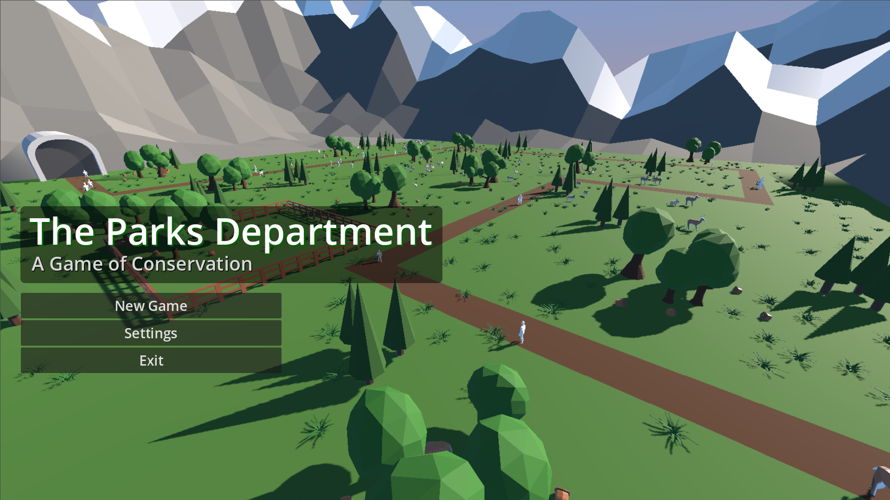

# User Documentation

## Table of Contents
1. [Introduction](#introduction)
2. [Installation](#installation)
3. [Usage](#usage)
4. [FAQ](#faq)

## Introduction 
This document provides a user guide for the Park Department's educational video game. The game teaches responsible forestry, species management, and handling of invasive species. 

## Installation 
1. Download the game from the Park Department's website. This can be found at [The Park Department Installer](https://github.com/NSuer/SeniorProject).
2. Extract the files from the downloaded zip folder. This can be done by right-clicking the folder and selecting "Extract All." Make sure to extract the files to a location that is easily accessible.
3. Run the installer. This can be done by double-clicking the installer file and following the on-screen instructions.
4. Once the installation is complete, launch the game by double-clicking the game icon on your desktop.

## Usage 

### Main Menu
The main menu of the game provides options to start a new game, load a saved game, access settings, and exit the game.
- To start a new game, click on the "New Game" button.
- To load a saved game, click on the "Load Game" button and select the saved game file.
- To access settings, click on the "Settings" button to adjust game options such as sound, graphics, and controls.
- To exit the game, click on the "Exit" button.

HW_Assignments/Photos

### Gameplay
The gameplay involves managing a virtual forest, planting trees, and protecting the forest from invasive species. Players can interact with various elements in the game using the mouse and keyboard.
- To place a builidng, click on the building icon and then click on the desired location in the forest.

- To release a species, click on the species icon and then click on the target location in the forest.

- To navigate the forest, use the arrow keys on the keyboard.

## FAQ 
- How do I save my progress in the game?
    - To save your progress, press the "ESC" button on the keyboard, this will take you to the pause screen. From here click on the "Save Game" button in the main menu. You can then choose a location to save the game file.

- How do I access the game settings?
    - To access the game settings, you can either click on the "Settings" button in the main menu or press the "ESC" button on the keyboard, this will take you to the pause screen, you can then press the settings button. This will open a window where you can adjust various game options.
- How do I exit the game?
    - To exit the game, click on the "Exit" button in the main menu or press the "ESC" button on the keyboard, this will take you to the pause screen, you can then click on the "Exit" button.
- How do I load a saved game?
    - To load a saved game, click on the "Load Game" button in the main menu. This will open a window where you can select the saved game file to load.
- Why are there plants growing in my forest that I didn't plant?
    - The game simulates the growth of plants over time. Some plants may appear in your forest that you didn't plant. This is part of the natural ecosystem simulation in the game.
- Why are my plants dying?
    - Plants must compete for resources such as sunlight, water, and nutrients. If a plant is not receiving enough resources, it may die. Make sure to manage your forest carefully to ensure the health of your plants.
- Why are invasive species appearing in my forest?
    - Invasive species can be introduced to your forest through various means such as birds, wind, or human activity. You must manage your forest to prevent the spread of invasive species and protect the native plants.
- Why are my animals dying?
    - Animals in the game require food to survive. If an animal is not finding enough food, it may die. Make sure to maintain a balanced ecosystem in your forest to support the wildlife. You're animals may also be dying dur to predation from other animals. Make sure to manage your forest to ensure the health of your animals.

